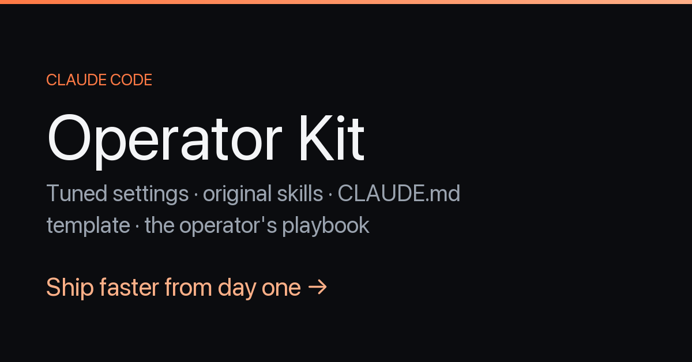

# onboard-repo — a Claude Code skill that understands a repo *before* editing it



Claude Code (and most coding agents) fail the same way in an unfamiliar repository: **they edit before they understand.** Confident-but-wrong changes, invented conventions, missed test gates.

This skill forces a one-pass onboarding ritual — stack, entry points, architecture map, conventions, risks, smallest test gate — and then **stops** with a six-line brief instead of diving into changes. It has been the single biggest quality bump in my setup.

Free. MIT. One file.

## Install

One-liner (per project):

```bash
mkdir -p .claude/skills/onboard-repo && curl -fsSL https://raw.githubusercontent.com/frohsinnllc/claude-code-onboard-repo/main/onboard-repo/SKILL.md -o .claude/skills/onboard-repo/SKILL.md
```

Or copy the `onboard-repo/` folder into `.claude/skills/` in your project — or into `~/.claude/skills/` to have it in every project.

Then, at the start of work in any repo Claude hasn't seen: ask it to *"onboard this repo first."* Claude Code picks the skill up by its description.

## What you get

A six-line brief before any code is touched:

```
STACK: ...
RUN/TEST/BUILD: ...
ARCHITECTURE (5 lines): ...
CONVENTIONS: ...
DO-NOT-TOUCH / ASK-FIRST: ...
SMALLEST GATE: ...
```

## Why it works

- It **separates understanding from changing.** Most wasted agent cycles come from mixing the two.
- **"Smallest relevant gate"** is the practical line: the cheapest test/build/lint command that validates a typical change — so verification happens *every* edit, not just before a PR.
- **"Stop here"** is the discipline. The brief is the deliverable; edits come after, on purpose.
- The risk pass (payments, auth, data writes, `TODO`/`FIXME`/`HACK`) gives the agent a do-not-touch map it otherwise never builds.

## The full skill

````markdown
---
name: onboard-repo
description: Use at the start of work in an unfamiliar repository — produces a fast, accurate mental model (stack, architecture, entry points, conventions, risks) before any code changes.
---

# Onboard a repository

Goal: in one pass, understand a repo well enough to make safe changes — without reading every file.

## Steps

1. **Shape.** Read `README*`, `CLAUDE.md`/`AGENTS.md`, `package.json`/`pyproject.toml`/`go.mod`, and any `/docs`. Note stack, scripts, and stated conventions.
2. **Entry points.** Find where execution starts (`main`, `server.*`, `index.*`, CLI bin, route registration). Trace one request/command end to end.
3. **Map layers.** Identify the boundaries: entry → routing/handlers → business logic → storage/external. Write them down as a 5-line map.
4. **Conventions.** Skim 3–4 representative source files. Capture naming, error handling, test style, and module organization — match these later.
5. **Risks.** Note the fragile/critical paths (payments, auth, data writes, deploys) and anything marked TODO/FIXME/HACK.
6. **Verify how.** Find the test/build/lint commands and which one is the *smallest relevant gate* for a typical change.

## Output

Produce a short brief:

```
STACK: ...
RUN/TEST/BUILD: ...
ARCHITECTURE (5 lines): ...
CONVENTIONS: ...
DO-NOT-TOUCH / ASK-FIRST: ...
SMALLEST GATE: ...
```

Stop here. Do not change code during onboarding — the brief is the deliverable.
````

*(Same content as [`onboard-repo/SKILL.md`](onboard-repo/SKILL.md) — the install one-liner above fetches it directly.)*

## Part of the Operator Kit

This skill is the free sample from the **Claude Code Operator Kit** — not another 200-skill library to forage through, but the curated handful that actually move your day-one productivity, tuned and explained:

- a tuned `settings.json` (sane permissions → fewer interruptions),
- a `CLAUDE.md` template that actually changes agent behavior,
- a companion **`ship-pr`** skill (branch → commit → PR with guardrails),
- the **Operator's Playbook** — the judgment a skill file can't give you: how to scope, verify, and dodge the expensive mistakes.

**€29 one-time · lifetime updates · 7-day refund** → [operator-kit-deploy.vercel.app](https://operator-kit-deploy.vercel.app?ref=github)

The skill in this repo is free and MIT-licensed regardless — use it, fork it, share it.

---

Questions, ideas, additions → open an issue. What does *your* agent setup do at the start of an unfamiliar repo?
